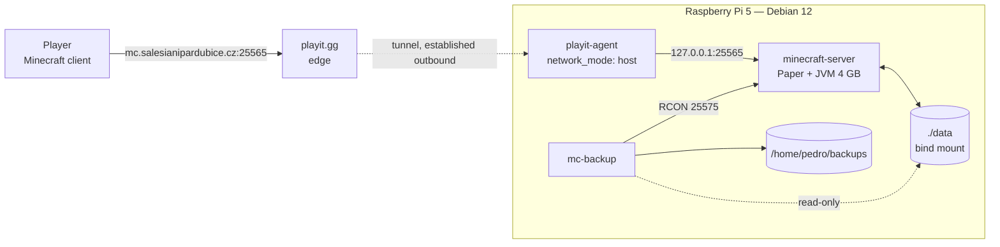

# Architecture

Status: **baseline — describes the system as it exists today (2026-09-13).**

This document is a faithful description of the current deployment, written so
that a full target architecture can be designed on top of it. It deliberately
contains no plans, no proposals, and no components that do not exist yet.
Open questions are collected at the end.

---

## 1. Overview

A single Raspberry Pi 5 runs a Paper Minecraft server for Salesian LAN parties
in Pardubice. The server has no public IP and sits behind the venue's NAT;
reachability from the internet is provided by an outbound tunnel to playit.gg,
which publishes the server at `mc.salesianipardubice.cz`.

The whole system is three Docker containers described by one
`docker-compose.yml`. There is no application code in this repository —
it is configuration only.



The tunnel is **outbound only**. Nothing on the internet initiates a connection
to the Pi; the agent dials out to playit.gg and the edge forwards player
traffic back down that connection. No port forwarding or firewall rule on the
venue network is required.

---

## 2. Components

### 2.1 `minecraft-server`

| | |
|---|---|
| Image | `itzg/minecraft-server:2026.5.2-java25` |
| Server | Paper, `VERSION: "LATEST"` → currently **26.2 build 123** |
| Heap | 4 GB (`MEMORY: "4G"`), Aikar GC flags enabled |
| Port | `25565` published on the host |
| Network | `mcnet` (bridge) |
| Volume | `./data` → `/data` |
| Restart | `unless-stopped` |

The image is a configuration generator as much as a runtime: on every start it
reads the `environment:` block and writes `server.properties`, `bukkit.yml`,
`spigot.yml`, `ops.json` and the rest into `/data`, then downloads the Paper
jar and any `MODRINTH_PROJECTS` plugins before launching the JVM.

Current gameplay configuration: survival, normal difficulty, PVP on, max 10
players, online-mode (Mojang auth) on, no whitelist, flight disabled, command
blocks disabled, spawn protection off, world size capped at 2000 blocks.

Performance-relevant settings, all chosen for the Pi:

- `VIEW_DISTANCE: 6`, `SIMULATION_DISTANCE: 6` — the dominant TPS lever.
- `ENTITY_BROADCAST_RANGE_PERCENTAGE: 50` — halves entity update traffic.
- `USE_AIKAR_FLAGS: "true"` — the community-standard G1GC tuning for Paper.
- `MAX_TICK_TIME: "-1"` — disables the watchdog, which would otherwise kill
  the server during GC pauses that are routine on this hardware.
- `ENABLE_AUTOPAUSE: "FALSE"` — the server stays warm between sessions.

RCON is enabled on port `25575`, bound inside `mcnet` only and never published
to the host. Because `RCON_PASSWORD` is unset, the image generates a random
password per volume and persists it in `data/server.properties` and
`data/.rcon-cli.env`; `mc-backup` picks it up from the shared `/data` mount.

### 2.2 `mc-backup`

| | |
|---|---|
| Image | `itzg/mc-backup:2026.5.0` |
| Network | `mcnet` |
| Volumes | `./data` → `/data` **read-only**, `/home/pedro/backups` → `/backups` |
| Restart | `unless-stopped` |

A sidecar loop: sleep, then for each cycle issue `save-off`, `save-all flush`
and `sync` over RCON, write a `tar.gz` of `/data` to `/backups`, re-enable
saving with `save-on`, and prune archives older than the retention window.

- `INITIAL_DELAY: 2m` — lets the server finish starting before the first run.
- `BACKUP_INTERVAL: 24h` — measured from container start, **not** wall-clock.
  The backup hour therefore drifts to whenever the stack was last restarted.
- `PRUNE_BACKUPS_DAYS: 14`.
- `BACKUP_NAME: world` → archives named `world-YYYYMMDD-HHMMSS.tar.gz`.

Because `/data` is mounted read-only, a bug or misconfiguration in this
container cannot corrupt the live world. The only writable path is `/backups`.

Note that the archive covers all of `/data`, not just the world directories —
plugin configuration and the Paper jar are included.

### 2.3 `playit`

| | |
|---|---|
| Image | `ghcr.io/playit-cloud/playit-agent:0.16` |
| Network | `network_mode: host` |
| Secret | `SECRET_KEY` from `.env` |
| Restart | `unless-stopped` |

Runs on the host network namespace, which is why it is not attached to `mcnet`:
it reaches the Minecraft server through the host's published `25565` rather
than through the bridge. Tunnel routing (which public address maps to which
local port) is configured in the playit.gg dashboard, not in this repository.

If `SECRET_KEY` is missing this container fails while the other two keep
running — the server is then reachable only on the LAN at `<pi>:25565`, which
is in fact sufficient for a LAN party.

---

## 3. Configuration model

The defining property of this system:

> **`docker-compose.yml` is the configuration. `data/` is generated state.**

Every setting a human would normally edit in `server.properties` is instead an
environment variable in the compose file, and the image rewrites the generated
files on each start. Hand-editing anything under `data/` is silently undone by
the next restart.

Two multi-line values use YAML block scalars and deserve care, because a line
commented out at the wrong indentation becomes part of the string rather than
a comment:

```yaml
OPS: |
  petrkucerak
MODRINTH_PROJECTS: |
  worldedit
  worldguard
```

Plugins have two independent installation paths that do not know about each
other. `MODRINTH_PROJECTS` entries are re-downloaded on every start and tracked
in `data/.modrinth-manifest.json`; jars dropped into `data/plugins/` by hand
load unconditionally. Removing a plugin therefore means removing both. Both
current plugins — WorldEdit 7.4.5 and WorldGuard 7.0.18 — come from Modrinth.
`data/plugins/spark/` is a leftover configuration directory whose jar is gone.

Image tags are pinned exactly. The Paper build is **not**: `VERSION: "LATEST"`
resolves at every start, so a restart can move the server to a new Minecraft
release without any change to this repository. The resolved build is recorded
in `data/.papermc-manifest.json`.

---

## 4. State and persistence

| Path | Contents | Tracked in git | Lifetime |
|------|----------|----------------|----------|
| `./data/world/` | The overworld and its dimensions (~14 MB) | no | the world's |
| `./data/plugins/` | Plugin jars and their config/data | no | regenerated + persistent mix |
| `./data/logs/` | Server logs | no | rotated by Paper |
| `./data/paper-*.jar` | Resolved Paper build (~64 MB) | no | until `VERSION` resolves differently |
| `./data/*.json`, `*.yml`, `*.properties` | Generated configuration | no | rewritten every start |
| `/home/pedro/backups/` | `world-*.tar.gz` archives | no | 14 days |
| `.env` | `SECRET_KEY` | no | host-local |

`data/` is roughly 388 MB in total, dominated by the Paper jar and libraries
rather than by the world. Against 805 GB of free NVMe, storage is not a
constraint anywhere in this system.

The only irreplaceable state is `data/world/` and `.env`. Everything else can
be regenerated by `docker compose up -d`.

---

## 5. Resource budget

| | |
|---|---|
| Physical RAM | 8 GB |
| JVM heap | 4 GB |
| Observed host usage at idle | ~6.4 GB used, ~1.4 GB available, swap exhausted |
| Observed CPU | ~1.4 % on `minecraft-server` with nobody online |
| Load average | ~0.25 |

RAM is the binding constraint of the entire system, and it is already tight at
idle. Disk, CPU and bandwidth are not. Any future component has to be evaluated
against the ~1.4 GB of headroom, not against the free disk space.

All images must support `linux/arm64`.

---

## 6. Operational model

Everything is driven from the Pi's shell:

- **Lifecycle** — `docker compose up -d` brings the entire stack up from a
  clean host, given only a `.env` and an existing `/home/pedro/backups`.
  `restart: unless-stopped` on all three services means the stack also survives
  a reboot without intervention.
- **Administration** — `docker exec -i minecraft-server rcon-cli` for live
  commands; the in-game console is also available because the container runs
  with `tty` and `stdin_open`.
- **Health** — the image ships a healthcheck; `minecraft-server` currently
  reports healthy. `mc-backup` uses a plain `depends_on` without a health
  condition, so it starts before the server is ready and relies on
  `INITIAL_DELAY` to bridge the gap.
- **Observability** — `docker compose logs` and `docker stats` only. There is
  no metrics collection, no alerting, and no uptime monitoring.

There is no host cron, no systemd unit, and no script that has to be run by
hand. This is deliberate: the entire system is reproducible from the compose
file.

---

## 7. Security posture

- **Ingress** is exclusively through the playit.gg tunnel. The Pi opens no
  inbound ports to the internet, and the tunnel connection is established
  outbound.
- **Authentication** is Mojang's, via `ONLINE_MODE: "TRUE"` — accounts are
  verified, so impersonation of a known player is not possible.
- **Authorisation** is a single operator (`petrkucerak`, level 4) seeded from
  the `OPS:` variable.
- **The server is not whitelisted.** `white-list=false` and
  `data/whitelist.json` is empty, so anyone who learns the public address can
  join. Griefing protection relies on WorldGuard regions and on the operator
  being present.
- **RCON** is reachable only from within the `mcnet` bridge network. Its
  password is generated per volume and stored in `data/server.properties`,
  which is gitignored.
- **Secrets** are limited to `SECRET_KEY` in `.env` (gitignored). There are no
  credentials in the repository.
- **Command blocks** are disabled, which removes a common redstone-based
  privilege-escalation and lag vector.

---

## 8. Failure modes

| Failure | Effect | Recovery today |
|---------|--------|----------------|
| `playit` down or `SECRET_KEY` invalid | No internet access; LAN access unaffected | Container restarts itself; fix the secret |
| playit.gg outage | Same as above | None available — the public address is theirs |
| Paper `LATEST` resolves to a new release | Plugins may fail to load after a restart | Manual; no pinned fallback |
| Server crash / OOM | Players disconnected | `restart: unless-stopped` brings it back |
| World corruption | Loss since the last archive | Restore from `/home/pedro/backups` by hand |
| Pi loses power | Everything down | Stack restarts on boot; unsaved chunks lost |
| Disk fills | Not currently plausible (805 GB free) | — |

Backup restoration has no documented procedure and has not been exercised.

---

## 9. Open questions

Deliberately unresolved; to be answered when the target architecture is
designed.

1. Should `VERSION` be pinned to an exact Paper release rather than `LATEST`?
2. Should the whitelist be enabled, and if so, who maintains it and how?
3. Who operates the server besides the repository owner, and do they need a
   path that does not involve SSH to the Pi?
4. Does the project need a web presence, and if so what does it actually do?
5. Is 24 h interval-based backup with 14-day retention the right policy for an
   event-driven server, and where should a second copy live?
6. What is the restore procedure, and how is it tested?
7. Is any monitoring or alerting needed, given that failures currently surface
   only when a player complains?
