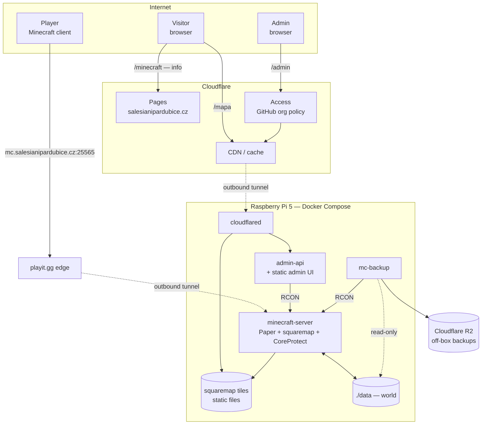

# Architecture

Status: **target architecture.** Sections marked *(dnes)* describe what already
runs; everything else is to be built. The migration path from one to the other
is in [§13](#13-migration).

Companion documents: [`AGENTS.md`](./AGENTS.md) for working rules,
[`README.md`](./README.md) for Czech operator instructions.

---

## 1. Purpose

A Minecraft server for the Salesian youth centre in Pardubice, serving two
audiences that share one world:

- **LAN parties** — a burst of up to ~20 players in one room over a weekend.
- **Long-term play** — a small group meeting on the server between events,
  building in a world that persists across months.

Around it, three public surfaces: information about the server, a browsable map
of the world, and an administration panel.

The system spans two independently deployed repositories:

| Repository                    | Contents                                                    | Deployed to                    |
| ----------------------------- | ----------------------------------------------------------- | ------------------------------ |
| `minecraft-server` (this one) | Pi stack: game server, backups, tunnel, map, admin API + UI | Raspberry Pi 5, Docker Compose |
| `salesianipardubice.cz`       | Main Astro website, incl. the Minecraft info page           | Cloudflare Pages               |

They are **not** linked by git submodules. What couples them is a documented
HTTP contract and a handful of shared brand tokens — see [§11](#11-repository-boundary).

---

## 2. Design principles

These are the load-bearing decisions. Everything below follows from them, and a
change that violates one is a redesign, not a tweak.

1. **The game server is independent.** If Cloudflare, the tunnel, the map, or
   the admin API fail, players still play. Nothing in the web path is on the
   critical path of the game.
2. **One writer per piece of state.** Every mutable thing has exactly one
   component allowed to write it. Two writers on the same state is the bug
   class that produces silent resurrection of deleted data — see the `OPS`
   trap in [§7](#7-state-ownership).
3. **The Minecraft server is the source of truth for game state.** Whitelist,
   operators, world, player data. There is **no external database** anywhere in
   this system.
4. **The cloud side is static.** No Pages Functions, no D1, no KV. The only
   dynamic component in the whole architecture is the admin API on the Pi.
5. **The Pi accepts no unsolicited inbound traffic.** Both tunnels are
   established outbound. No port forwarding, no firewall rules on the venue
   network.
6. **Everything is reproducible from `docker-compose.yml`.** No host cron, no
   systemd units, no scripts a human must remember to run. `docker compose up -d`
   on a clean host is the whole deployment.
7. **Pin every version.** Game, plugins, images. Upgrades are deliberate edits,
   never a side effect of a restart. See [§6](#6-version-policy).

---

## 3. System overview



Two independent outbound tunnels leave the Pi: **playit.gg** carries the game's
raw TCP, **cloudflared** carries HTTPS. They share no failure mode beyond the
Pi's own uplink — the map going down does not take the game with it.

---

## 4. Naming and routing

| URL                                     | Serves                          | Backed by                       | Survives Pi outage |
| --------------------------------------- | ------------------------------- | ------------------------------- | ------------------ |
| `mc.salesianipardubice.cz:25565`        | the game                        | playit.gg (A record, unchanged) | no                 |
| `salesianipardubice.cz/minecraft`       | info, how to connect, LAN dates | Cloudflare Pages, static        | **yes**            |
| `minecraft.salesianipardubice.cz/mapa`  | world map                       | Pi via cloudflared              | no                 |
| `minecraft.salesianipardubice.cz/admin` | administration                  | Pi via cloudflared + Access     | no                 |
| `minecraft.salesianipardubice.cz/api/*` | admin JSON API                  | Pi via cloudflared + Access     | no                 |

Two deliberate choices here:

**`mc.` is never touched.** It stays a plain A record to playit's anycast
address. A single hostname cannot be both an A record to playit and a CNAME to
a Cloudflare tunnel, and the workaround — an SRV record at
`_minecraft._tcp.mc.` — would mean changing the one DNS record that currently
works for players, for a cosmetically shorter URL. Not worth the risk. The web
surfaces live on a new `minecraft.` hostname instead.

**Info lives on the main site, not on `minecraft.`.** It is the one surface
people look for precisely when the server is down, so it must not depend on the
Pi. It is also plain content: it belongs where the rest of the organisation's
content is, and inherits design, navigation and SEO for free.

`minecraft.salesianipardubice.cz` is a single origin — one Cloudflare tunnel,
one hostname, no CORS. Access policies are applied per path: `/mapa` public,
`/admin` and `/api/*` restricted.

---

## 5. Components

### 5.1 `minecraft-server` *(dnes)*

Paper, pinned, 4 GB heap, published on host port `25565`, on the `mcnet`
bridge, bind-mounting `./data`. The `itzg/minecraft-server` image regenerates
all configuration from the compose `environment:` block on every start; see
[§8](#8-configuration-model).

Plugins, all from `MODRINTH_PROJECTS`:

| Plugin          | Role                        | Why it is not optional                                              |
| --------------- | --------------------------- | ------------------------------------------------------------------- |
| WorldEdit       | operator editing tool       | —                                                                   |
| WorldGuard      | region protection           | protects spawn and long-term builds during events                   |
| **CoreProtect** | block-change log + rollback | the only way to undo grief **without** rolling the whole world back |
| **squaremap**   | map tile renderer           | serves [§9](#9-map)                                                 |

CoreProtect earns its place specifically because LAN parties and long-term play
share one world. Without a block log, the only recovery from a griefed build is
restoring the entire world from a backup — which also discards everything
everyone else did since. CoreProtect turns that into a targeted rollback.

### 5.2 `mc-backup` *(dnes, to be extended)*

Sidecar that quiesces the server over RCON (`save-off` → `save-all flush` →
`sync`), archives `/data`, then `save-on`. `/data` is mounted **read-only**, so
a fault here cannot corrupt the live world. See [§10](#10-backups).

### 5.3 `cloudflared` *(new)*

Cloudflare Tunnel agent. Establishes an outbound connection to Cloudflare and
routes `minecraft.salesianipardubice.cz` to two local origins:

- `/mapa/*` → the squaremap tile directory
- `/admin`, `/api/*` → `admin-api`

Credentials come from `.env`. If this container is down, the game is unaffected.

### 5.4 `admin-api` *(new)*

A small service on `mcnet` holding an RCON connection to the server, serving
both the JSON API and the static admin UI. Written in **Go** — a static ARM64
binary in a scratch image keeps the footprint near 30 MB, which matters here
([§12](#12-resource-budget)).

Exposed operations:

| Operation                                       | Implementation                   |
| ----------------------------------------------- | -------------------------------- |
| server status — online players, version, uptime | RCON `list`, cached briefly      |
| whitelist — list, add, remove                   | RCON `whitelist …`               |
| operators — list, add, remove                   | RCON `op` / `deop`               |
| force a backup                                  | signal the `mc-backup` container |
| restart the server                              | RCON `stop`                      |

**Restart is deliberately implemented as `rcon-cli stop`,** relying on
`restart: unless-stopped` to bring the container back. The obvious alternative —
mounting the Docker socket so the API can restart the container — would hand
root-equivalent host access to the one component reachable from the internet.
The RCON route achieves the same result with no privilege at all.

### 5.5 Main website — the info page *(new, other repo)*

A static Astro page at `salesianipardubice.cz/minecraft`: what the server is,
the address to connect to, how to get access through the kroužek, house rules,
and the dates of upcoming LAN weekends. Dates are **content**, managed through
the existing Sveltia CMS as a content collection — a commit triggers a Pages
rebuild. No database, no admin screen, no API.

---

## 6. Version policy

`VERSION: "LATEST"` is abolished. It silently moved this server to Paper 26.2
ahead of the plugin ecosystem, and because Minecraft cannot downgrade a world,
that decision could not be walked back without discarding the world.

**The pinned version is chosen as the intersection of plugin support, not as
the newest release.** As of 2026-09-13:

| Plugin | Supports 26.1.2 | Supports 26.2 |
|---|---|---|
| WorldEdit | ✅ 7.4.5 | ✅ 7.4.5 |
| WorldGuard | ✅ 7.0.18 | ✅ 7.0.18 |
| squaremap | ✅ 1.3.13.1 | ✅ 1.3.15 |
| **CoreProtect** | ✅ 24.0 | ❌ no build |

→ **`VERSION: "26.1.2"`**.

CoreProtect is the sole blocker, and the choice is therefore narrow: reset the
world and have block logging from day one, or keep the world and wait for a
26.2 build. We reset, because **the cost of resetting only ever goes up**. This
is the cheapest moment the long-term world will ever have to start properly,
and starting it without a block log would leave its first months unprotected —
exactly the period when the habit of building gets established.

Revisit once CoreProtect ships 26.2 support: at that point the upgrade is
ordinary and carries no world reset.

Upgrade procedure: check that every plugin in `MODRINTH_PROJECTS` lists the
candidate version on Modrinth, bump `VERSION`, `docker compose up -d`, verify
the plugins actually loaded in the log. Never during an event, always with a
fresh backup in hand. Container image tags are pinned exactly and bumped the
same deliberate way.

---

## 7. State ownership

Principle 2 in concrete terms. Each row has exactly one writer.

| State                | Lives in                      | Written by         | Notes                           |
| -------------------- | ----------------------------- | ------------------ | ------------------------------- |
| World                | `data/world/`                 | the server         | the only irreplaceable state    |
| Whitelist            | `data/whitelist.json`         | admin API via RCON | not mirrored anywhere           |
| Operators            | `data/ops.json`               | admin API via RCON | see the trap below              |
| Block history        | CoreProtect SQLite            | the plugin         | for rollback only               |
| Map tiles            | `data/plugins/squaremap/web/` | squaremap          | derived, disposable             |
| Server configuration | `docker-compose.yml`          | a human, in git    | regenerates `data/*` each start |
| LAN party dates      | main website repo             | Sveltia CMS        | content, not state              |
| Tunnel secrets       | `.env`                        | a human            | gitignored                      |

**The `OPS` trap.** The image's `start-setupRbac` script treats an `OPS:` list
in MERGE mode: existing `ops.json` entries are preserved and the env list is
added on top. So an operator granted over RCON survives a restart — but an
operator **removed** through the admin panel is silently re-added on the next
`docker compose up -d` if their name is still in `OPS:`.

Therefore, once the admin panel manages operators, **`OPS:` must be reduced to a
single break-glass owner** and never used as the working operator list. This is
principle 2 in action: two writers, one of which quietly resurrects what the
other deleted.

---

## 8. Configuration model *(dnes)*

> **`docker-compose.yml` is the configuration. `data/` is generated state.**

The image rewrites `server.properties`, `bukkit.yml`, `spigot.yml`, `ops.json`
and the rest from environment variables on every start. Hand-editing anything
under `data/` is undone by the next restart.

Two values use YAML block scalars (`OPS`, `MODRINTH_PROJECTS`) where a line
commented out at the wrong indentation silently becomes part of the string.
Verify with `docker compose config` after touching them.

Plugins have two installation paths that do not know about each other:
`MODRINTH_PROJECTS` entries are re-downloaded every start; jars placed in
`data/plugins/` by hand load unconditionally. Removing a plugin means removing
both.

---

## 9. Map

squaremap renders the world to **plain PNG tiles on disk**. This single fact
drives the design: rendering is expensive, serving is free.

- `cloudflared` serves the tile directory as static files. squaremap's built-in
  webserver is not exposed; it is an implementation detail.
- Cloudflare caches tiles at the edge, so repeat visitors cost the Pi nothing.
- **Throttling means throttling the renderer, not the website.** Background
  rendering is **scheduled for night hours** rather than driven by player count:
  a fixed window is far simpler than reacting to who is online, and the map
  merely goes a few hours stale, which is invisible on a survival world. There
  is no reason to choose between having a map and having player capacity.
- The one genuinely heavy operation is the **initial full render**. Run it once,
  overnight, before the world is opened to players.

squaremap runs inside the server JVM, so its render buffers compete with
gameplay for the same 4 GB heap — the reason to throttle during play is heap
pressure and CPU inside the JVM, not host memory.

The relevant keys in `plugins/squaremap/config.yml`, as of 1.3.13.1:
`internal-webserver.enabled` (**disabled** — `admin-api` serves the tiles, so
the plugin's own HTTP server is a redundant second surface),
`max-render-threads` (set to **2**, leaving two of the Pi's four cores for the
tick loop; the default `-1` means all of them), and
`background-render.{enabled,max-chunks-per-interval,interval-seconds}`.

Measured on the freshly generated world: a full render of all three dimensions
took **5 seconds** at ~1000 chunks/s. The "run it overnight" caution applies to
a world with substantial explored territory, not to a new one.

> **Reproducibility gap.** This file lives under `data/`, which is gitignored,
> and the settings above were applied by hand. `docker compose up -d` on a clean
> host would therefore *not* reproduce them — a direct violation of principle 6.
> Plugin configuration is unlike server configuration: the image regenerates
> `server.properties` from the compose file, but it does not manage plugin
> configs at all. Closing this needs a deliberate mechanism (a versioned file
> bind-mounted into place, or the image's config-patching support). Until then
> the settings are undocumented state on one machine.

---

## 10. Backups

Current behaviour *(dnes)*: `world-*.tar.gz` every 24 h from container start,
14-day retention, written to `/home/pedro/backups`.

Two defects, both to be fixed:

**It is a copy, not a backup.** The archives sit on the same NVMe as the world
they protect. A disk failure or a mistaken `rm` takes both. This stopped being
theoretical on 2026-09-13: retention pruned the last pre-upgrade archive at
13:56:33, one minute after the server had already upgraded the world — removing
the only artifact that would have made a rollback possible.

→ **An off-box copy is required.** The world is ~14 MB, so Cloudflare R2's free
10 GB tier holds years of history. The upload is outbound-only, consistent with
principle 5.

> **Deferred.** Cloudflare R2 requires a payment card on file, so off-box
> backups are not yet active. Until they are, **the only protection is the local
> 14-day window on the same disk as the world** — the defect described above is
> live, not hypothetical. This is the largest open risk in the system and should
> be closed before the world accumulates anything worth keeping. Any off-box
> destination works; R2 is a preference, not a requirement.

The `itzg/mc-backup` image ships both `restic` and `rclone`
(`BACKUP_METHOD` accepts `tar`, `restic`, `rsync`). The intended design uses
`restic` against R2, for two properties a plain file mirror does not have:
deduplication, so a year of history of an incrementally-changing world costs
little more than a few full copies, and built-in grandfather-father-son
retention.

**One container cannot do both.** `BACKUP_METHOD` is a single value, so local
`tar` archives and off-box `restic` snapshots need **two `mc-backup`
containers** with staggered `INITIAL_DELAY` so their `save-off` windows do not
overlap. That is deliberate rather than wasteful: during a LAN party the venue's
uplink may be unavailable, and a rollback should not depend on reaching the
internet. Cost is roughly 20 MB.

Retention off-box is deliberately longer than the local 14 days:

| Tier | Kept |
|---|---|
| daily | 14 |
| weekly | 8 |
| monthly | 12 |

The local 14-day window only protects against damage noticed immediately.
Grief or corruption discovered a month later — the realistic case on a server
people visit irregularly — needs the monthly tier.

**Restore has never been exercised.** An untested restore is not a backup.
The procedure must be written down, run at least once against a scratch copy,
and re-run after any version change.

Also note the schedule is interval-based from container start, not wall-clock,
so the backup hour drifts with every restart.

---

## 11. Repository boundary

The two repositories stay independent. **No git submodules** — they would add
ceremony without buying independence, and nothing here is compiled together.
What actually crosses the boundary is small:

- **The HTTP contract** — the admin API's shape. Documented in this repository;
  the website does not call it at all today, since the info page is static.
- **Brand tokens** — five CSS custom properties (`--brand-primary: #DB0016`,
  `--brand-secondary`, `--brand-accent`, `--brand-light`, `--brand-dark`) and
  the Chronica Pro webfont.

The admin UI is served **from the Pi**, not from Pages, and lives in this
repository alongside the API it talks to. Three reasons: it is always version-
matched to its API; it keeps `minecraft.salesianipardubice.cz` a single origin
with no CORS; and an administration tool should not depend on a second
deployment pipeline being healthy, since it is the break-glass interface.

It still looks like the main site: duplicating five CSS variables and two font
files is far cheaper than coupling two repositories, and this is exactly the
"contract, not shared source tree" principle.

---

## 12. Resource budget

The binding constraint of the entire system is **RAM**, not disk, CPU or
bandwidth. 8 GB total; ~805 GB of free NVMe is irrelevant by comparison.

| Consumer                                     | Budget  |
| -------------------------------------------- | ------- |
| JVM heap                                     | 4.0 GB  |
| JVM overhead (metaspace, GC, direct buffers) | ~0.7 GB |
| `cloudflared`                                | ~40 MB  |
| `admin-api`                                  | ~30 MB  |
| `mc-backup` (idle; spikes while archiving)   | ~20 MB  |
| OS + Docker                                  | ~0.8 GB |

Every image must be `linux/arm64`.

**Measuring this on the Pi is misleading while anyone is developing on it.**
A VS Code remote server and an agent session together hold roughly 1.9 GB, so
`free -h` run over SSH reports far less headroom than the deployed system has.
Measured immediately after the 26.1.2 migration: 7.1 GB used, of which the JVM
was 4.5 GB and developer tooling 1.9 GB. Subtract the latter before concluding
anything about capacity.

### Tuning for ~20 players

`MAX_PLAYERS: 20`, and one correction to the current settings:

```
VIEW_DISTANCE: 6        SIMULATION_DISTANCE: 6     # today
VIEW_DISTANCE: 8        SIMULATION_DISTANCE: 4     # target
```

These are routinely confused but cost very differently. *View distance* is how
far chunks are **sent** to clients — memory and bandwidth, relatively cheap.
*Simulation distance* is how far the server **ticks** entities, redstone, mob AI
and growth — the expensive one, and it scales badly. Holding them equal pays
full simulation cost for a needlessly short sight line. The target setting lets
players see **further** than today while the server does **less** work.

Heap stays at 4 GB. At ten players 3 GB would have been enough; at twenty it is
not, and the new containers fit comfortably in the remaining headroom.

**Load follows loaded chunks, not player count.** Twenty players building
together in one area is markedly cheaper than five players exploring in five
directions. A LAN party is therefore the easier of the two workloads.
`MAX_WORLD_SIZE: 2000` is a meaningful part of this budget and stays.

---

## 13. Migration

Ordered, because some steps depend on others. The world is **discarded** at
step 3: pinning to 26.1.2 is a downgrade from the 26.2 the world has already
been saved in, and Minecraft cannot load a world backwards. That downgrade is
being made solely to get CoreProtect ([§6](#6-version-policy)) — so step 3 is
the one step that buys a capability at the price of the existing world, and the
one to revisit if a CoreProtect 26.2 build appears before it is executed.

1. ~~Add off-box backups and **test a restore**.~~ **Deferred**, see
   [§10](#10-backups). Executed instead: the pre-migration world was archived to
   `/home/pedro/world-archive/` with a checksum, outside the pruning window.
2. ✅ Pin `VERSION: "26.1.2"`; add `squaremap` and `coreprotect` to
   `MODRINTH_PROJECTS`, with every plugin pinned to an exact version.
3. ✅ Stop the stack, move `data/world` aside, start fresh. Verify in the log
   that all four plugins loaded.
4. ✅ Apply the 20-player tuning ([§12](#12-resource-budget)); enable the
   whitelist; keep `OPS:` at a single break-glass owner
   ([§7](#7-state-ownership)).

   The whitelist is enabled with **no `WHITELIST:` environment list**. That
   variable carries the same MERGE semantics as `OPS`, so any name in it would
   be re-added after the admin panel removed it. The admin API is the only
   writer; operators bypass the whitelist, which is how the first administrator
   gets in while the list is still empty.
5. ✅ Run the initial full map render — 5 s on the new world, no overnight
   window needed.
6. ✅ Add `cloudflared` (pinned `2026.9.1`, token from `.env`, on `mcnet`).
   ⏳ The public hostname must still be routed to `admin-api:8080` in the
   Cloudflare dashboard: a token-based tunnel takes its ingress rules from
   Cloudflare, not from a local config file, so this step cannot be done from
   the repository.
7. ⏳ `admin-api` exists and serves `/mapa` and `/healthz`
   ([§5.4](#54-admin-api-new)). Still to build: `/admin`, `/api/*`, RCON
   wiring, and the Cloudflare Access policy in front of them.
8. Add the info page to the main website repository.
9. Close the deferred off-box backup ([§10](#10-backups)).

`mc.salesianipardubice.cz` is not touched at any step.

---

## 14. Security posture

- **Ingress** is exclusively through two outbound tunnels. The Pi opens no
  inbound ports to the internet.
- **Player authentication** is Mojang's (`ONLINE_MODE: "TRUE"`), so a known
  player cannot be impersonated.
- **Server access** is by whitelist. Players are admitted through the kroužek's
  existing enrolment process, which also handles GDPR — there is no public
  registration form on the web, and therefore no personal data in this system
  beyond Minecraft usernames.
- **Admin authentication** is **Cloudflare Access with GitHub as the identity
  provider**, authorising on membership of the **`salesianipardubice`** GitHub
  organisation — in practice, the people who can already contribute to this
  repository. (Access policies match reliably on organisation; whether they can
  narrow to a specific team is to be confirmed when the policy is created.) No passwords, no
  session handling, and no authentication code in this repository. It mirrors
  how Sveltia CMS already authenticates against the website repository.
- **The admin API verifies the `Cf-Access-Jwt-Assertion` JWT** rather than
  assuming that traffic arriving on the tunnel came through Access. Cheap to
  implement, and the difference between "secure" and "secure until something is
  misconfigured".
- **The admin API holds no host privilege.** No Docker socket (see
  [§5.4](#54-admin-api-new)); its entire blast radius is the set of RCON
  commands it chooses to expose.
- **RCON** is reachable only from within `mcnet`, never published to the host.
  Its password is generated per volume and stored in gitignored files.
- **Secrets** are the playit and cloudflared tokens and the R2 credentials, all
  in `.env`, gitignored. No credentials in the repository.

---

## 15. Failure modes

| Failure                          | Effect on the game                                       | Effect on the web                                          |
| -------------------------------- | -------------------------------------------------------- | ---------------------------------------------------------- |
| `playit` or playit.gg down       | no remote play; **LAN play unaffected**                  | none                                                       |
| `cloudflared` or Cloudflare down | **none**                                                 | map and admin unreachable; info page still served by Pages |
| Map renderer misbehaving         | heap/CPU pressure; throttle or disable it                | stale tiles                                                |
| `admin-api` down                 | none                                                     | admin unreachable; RCON over SSH still works               |
| Server crash / OOM               | players disconnected; `restart: unless-stopped` recovers | map goes stale                                             |
| Grief                            | —                                                        | rollback via CoreProtect, not a world restore              |
| World corruption                 | loss back to the last archive                            | —                                                          |
| Pi loses power or uplink         | everything down                                          | info page still served                                     |
| Disk full                        | implausible — 805 GB free                                | —                                                          |

The pattern to preserve: no failure in the right-hand column can cause one in
the left.

---

## 16. Open questions

Resolved during design; recorded because the reasoning matters later.

- **Plugin behaviour on an unsupported version** — assumed to be refusal, and
  the supported version is prioritised accordingly. Not measured; if a
  CoreProtect 26.2 build appears, the question becomes moot.
- **Off-box retention** — 14 daily / 8 weekly / 12 monthly via restic,
  [§10](#10-backups).
- **Map render scheduling** — a fixed night window, not player-count driven,
  [§9](#9-map).
- **Admin group** — the `salesianipardubice` GitHub organisation,
  [§14](#14-security-posture).

Still open:

1. **Is kroužek enrolment the only route onto the server, permanently?**
   Today's design says yes, and that is precisely what lets the whole cloud side
   stay static with no database anywhere. The question is whether someone
   *outside* the kroužek will eventually need to ask for access — a sibling, a
   friend of a player, an alumnus who moved away. If that day comes, they need a
   request form, a form needs somewhere to hold pending requests until an admin
   decides, and that reintroduces web-side state and a database.

   Nothing needs deciding now: the architecture can absorb it later by adding a
   pending-request store on the cloud side, without disturbing the rule that the
   Minecraft server remains the source of truth for the whitelist itself. It is
   worth knowing whether to expect it.
